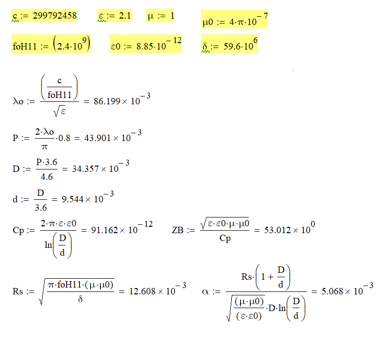
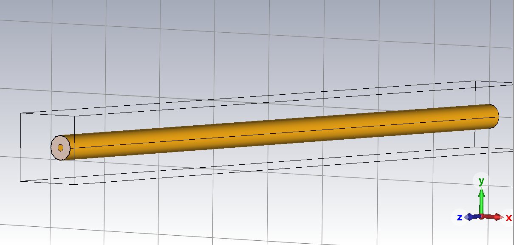
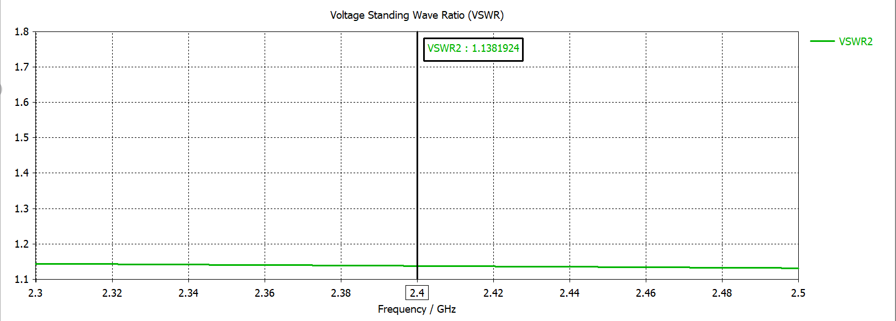
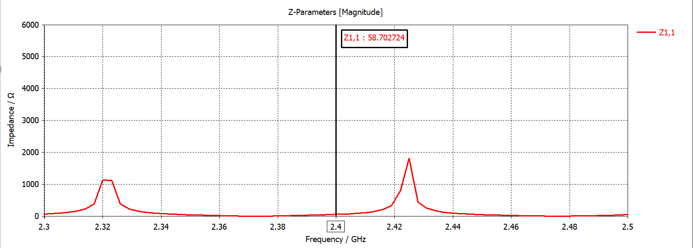
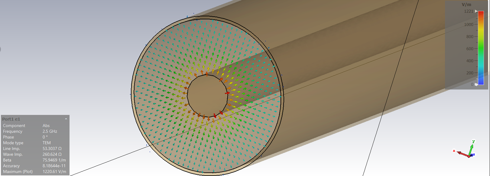
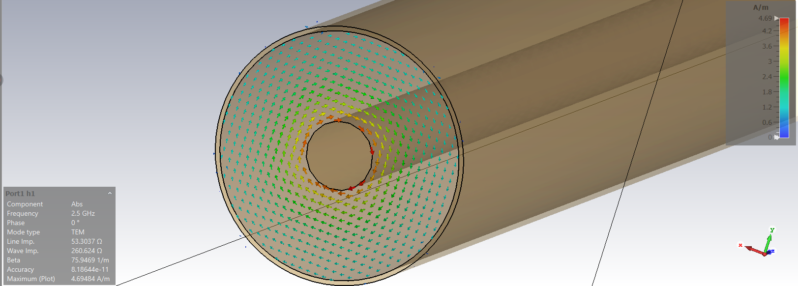

  <b>Русский</b> | <a href="README.en.md">English</a> | <a href="README.de.md">Deutsch</a>

# Моделирование коаксиальной линии передачи (2.4 ГГц)

Репозиторий содержит результаты проектирования, аналитического расчета и трехмерного электромагнитного моделирования коаксиальной линии передачи, оптимизированной для работы на частоте **2.4 ГГц**.

Основная задача проекта — расчет геометрических параметров коаксиальной структуры под заданное волновое сопротивление (50 Ом) и верификация полученных характеристик методами численного анализа.

---

## Структура проекта

* `/cad` — геометрическая твердотельная модель коаксиальной структуры в формате SolidWorks (`.sldprt`).
* `/calculations` — математический расчет параметров коаксиального кабеля в Mathcad (`.xmcd`).
* `/simulation` — проект полноволнового электромагнитного моделирования в CST Studio Suite (`.cst`).
* `/docs/images` — графические материалы результатов моделирования и расчетов.

---

## 1. Аналитический расчет параметров

Математический расчет физических размеров (внутреннего диаметра проводника $d$ и внешнего диаметра диэлектрика $D$) выполнен в Mathcad с учетом характеристик заполняющего диэлектрика — фторопласта ($\varepsilon = 2.1$). Расчетное волновое сопротивление линии составило ~53 Ом.

---

## 2. 3D-моделирование

На основе аналитических параметров в среде SolidWorks подготовлена геометрическая твердотельная модель коаксиальной линии передачи для последующего импорта и анализа в САПР CST Studio Suite.

---

## 3. Результаты электромагнитного моделирования

### 3.1. Согласование и импеданс

Оценка характеристик согласования линии передачи показывает сходимость аналитических результатов и результатов численного моделирования. На центральной рабочей частоте 2.4 ГГц коэффициент стоячей волны по напряжению (КСВН/VSWR) составляет 1.138.

**График КСВН (VSWR):**

**Z-параметры (входное сопротивление):**

### 3.2. Распределение полей (TEM-мода)

Ниже представлено векторное распределение напряженности электрического ($E$) и магнитного ($H$) полей в поперечном сечении коаксиальной линии на частоте 2.5 ГГц. Волновое сопротивление порта при моделировании составило 53.3 Ом.

**Напряженность электрического поля (E-field):**

**Напряженность магнитного поля (H-field):**

## Лицензия

Copyright (c) 2026 Илья Корнилов

Этот исходный документ описывает открытое аппаратное обеспечение (Open Hardware) и распространяется под лицензией CERN-OHL-P v2. 
Вы можете распространять и изменять этот исходный документ, а также производить на его основе продукты в соответствии с 
условиями лицензии CERN-OHL-P v2 (https://cern.ch/cern-ohl).

Этот исходный документ распространяется БЕЗ КАКИХ-ЛИБО ЯВНЫХ ИЛИ ПОДРАЗУМЕВАЕМЫХ ГАРАНТИЙ, 
ВКЛЮЧАЯ ГАРАНТИИ ТОВАРНОЙ ПРИГОДНОСТИ, УДОВЛЕТВОРИТЕЛЬНОГО КАЧЕСТВА ИЛИ СООТВЕТСТВИЯ 
КОНКРЕТНЫМ ЦЕЛЯМ. Пожалуйста, ознакомьтесь с условиями CERN-OHL-P v2 для получения подробной информации.